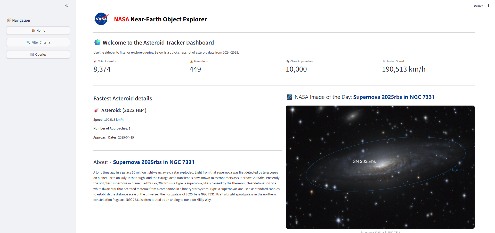
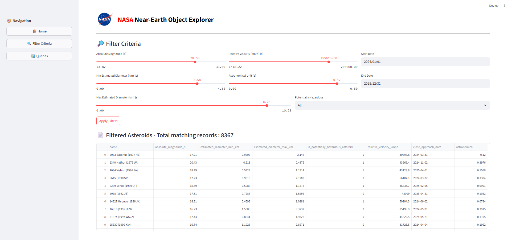
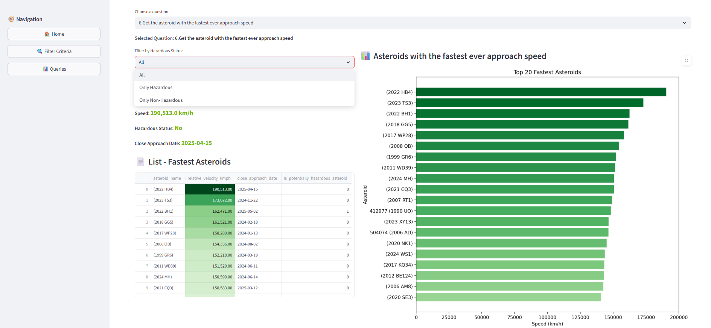

NASA Near-Earth Object Dashboard
A Streamlit-based web dashboard that visualizes asteroid data from NASA's API, stores it in a local MySQL database, and provides interactive filtering, predefined queries, and insights.

📌 Features
✅ Interactive dashboard built with Streamlit
✅ Fetches asteroid data from NASA API
✅ Stores & retrieves data from MySQL database
✅ Multiple pages:

🏠 Home → Summary metrics + NASA Image of the Day

🔍 Filter Criteria → Filter asteroids by magnitude, velocity, diameter, and date
    Displays filtered results in a table

📊 Queries → 15 predefined queries with tables & visualizations

How It Works
1️⃣ Data Fetching
data_fetch/fetch_nasa_data.py → Fetches asteroid data from NASA API.

data_fetch/populate_db.py → Processes and stores the data in MySQL tables.

2️⃣ Database Structure
asteroids → Basic asteroid details.

close_approach → Approach details like velocity, date, and distance.

3️⃣ Dashboard App
app.py → Main Streamlit app with navigation.

views/home.py → Displays summary metrics and NASA Image of the Day.

views/filter_criteria.py → Provides filtering options for asteroid data.

views/queries.py → Shows 15 predefined SQL queries with visualizations.